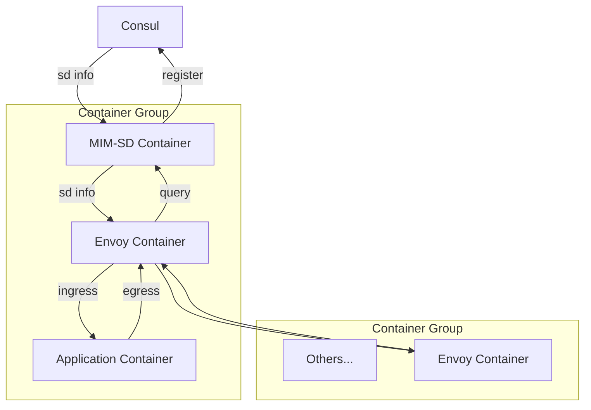

# README

**概述：** `mim-sd`模块是一个Envoy的代理增强，旨在提供xDS接口以实现动态的服务发现功能，其以Sidecar的模式与业务模块同时启动

**主要功能：**

1. 读取用户配置文件（即`Spring`配置文件），在容器组启动时向Consul注册当前服务
2. 通过xDS接口为Envoy提供服务发现功能
3. （TODO）高级功能，如流量控制、熔断、限流等

**实现：** 为减少容器大小，使用Go开发`mim-sd`，直接编译为二进制执行
